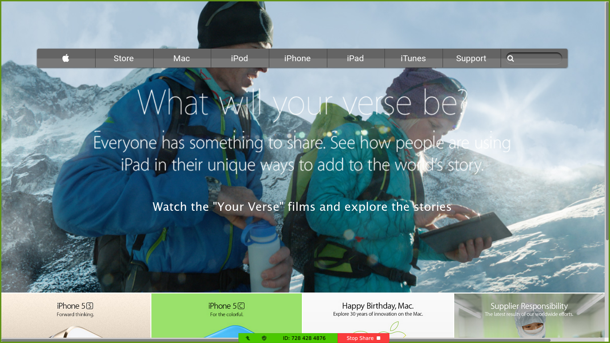

# Building-with-Backgrounds-and-Gradients-MPS

Building an HTML and css page that matches the appearance of this page [Apple](https://web.archive.org/web/20140301004610/http://www.apple.com/)

# Built With

- [HTML](https://developer.mozilla.org/en-US/docs/Web/HTML)
- [CSS](https://www.w3schools.com/css/)
- [Fontawesome](https://fontawesome.com/)

# Original Page

  

# Live Demo

[Click here for Live Demo](https://jssarrazolaa.github.io/Building-with-Backgrounds-and-Gradients-MPS/)

# Getting Started

# Authors

### Jhonatan Sarrazola

- Github: [@jssarrazolaa](https://github.com/jssarrazolaa)
- Twitter: [@StevenAlvarez_](https://twitter.com/StevenAlvarez_)
- Linkedin: [Jhonatan Sarrazola](https://www.linkedin.com/in/jhonatan-sarrazola-6a46a01a5/)

### Tazoh Yanick Tazoh

- Github: [@t-yanick](https://github.com/t-yanick)
- Twitter: [@ElTazoh](https://twitter.com/ElTazoh)
- Linkedin: [tazoh-yanick](https://linkedin.com/in/tazoh-yanick-5a978764)

# Contributing

Contributions, issues and feature requests are welcome!
Feel free to check the [issues page](hhttps://github.com/jssarrazolaa/Building-with-Backgrounds-and-Gradients-MPS/issues).

# Show your support

If you like our work, please give us a :+1:

# Acknowledgments

- Microverse
- W3schools
- Freecodecamp
- Developer.mozilla
- Learnshayhowe
- Odin project

# License

This project is [MIT](https://opensource.org/licenses/MIT) licensed.
